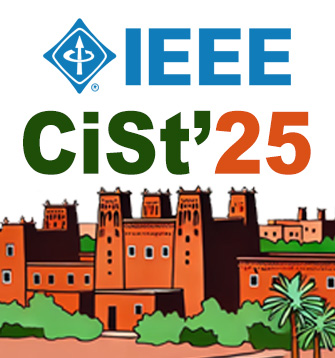
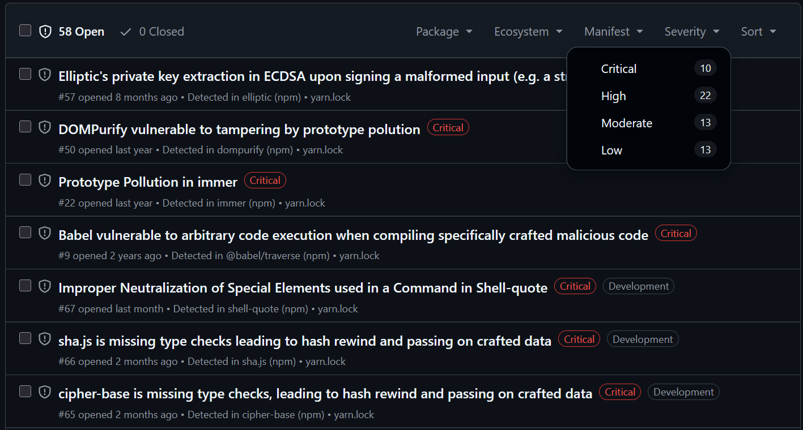
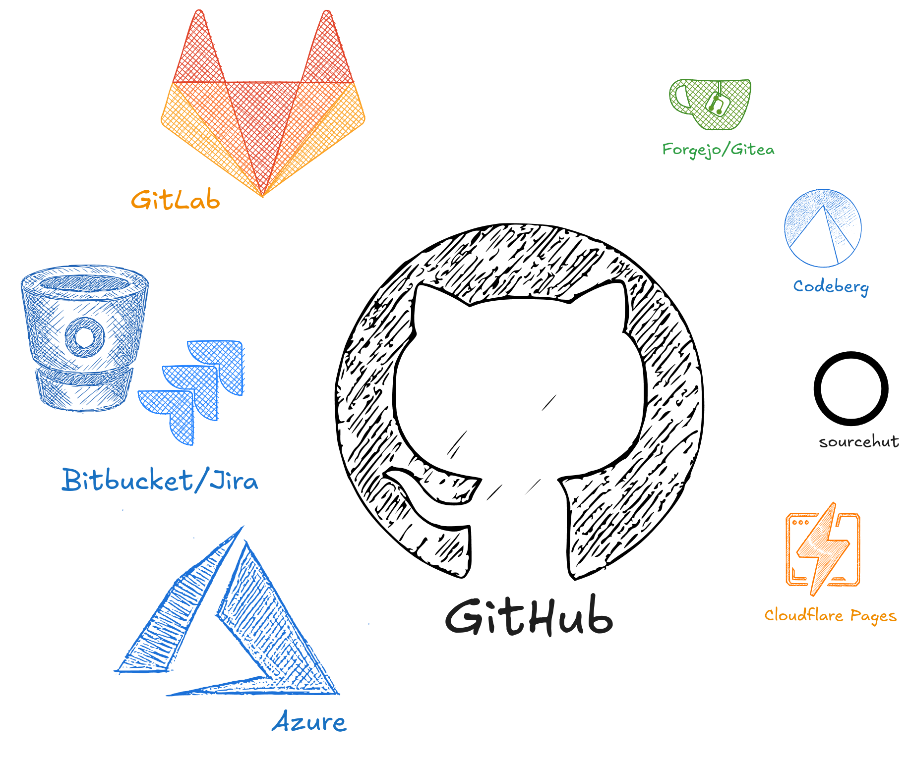
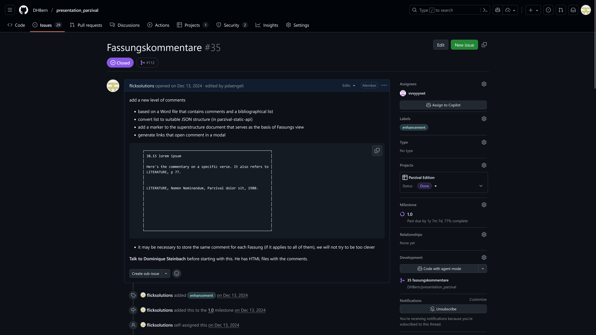
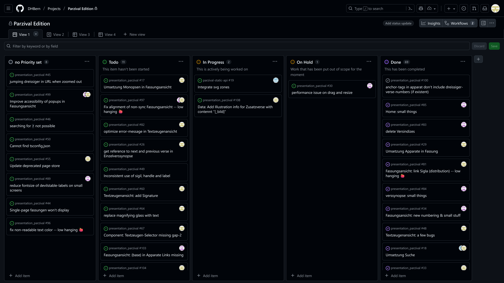

# Leveraging Code-Sharing Platforms for Textual Digitization




<p class="bg bt-left"><a href="mailto:peter.daengeli@unibe.ch">Peter Dängeli</a>, <a href="mailto:sebastian.flick@unibe.ch">Sebastian Flick</a></p>
<p class="bg bt-right"><a href="https://dsl.unibe.ch" target="_blank">Data Science Lab</a>, <a href="https://dh.unibe.ch" target="_blank">Digital Humanities</a>, University of Berne</p>

<style>
  h1 {
    font: 2em var(--font-family) !important;
  }
  .bg {
    position: absolute;
    z-index: -1;
    font-size: 0.7em;
  }
  .bt-left {
    bottom: 0;
    left: 0;
  }
  .bt-right {
    bottom:0;
    right: 0;
  }
</style>

---

[https://dsl-unibe-ch.github.io/ieee-cist25](https://dsl-unibe-ch.github.io/ieee-cist25)


---

## Keeping projects alive is hard

|||
|:--:|:--:|
|[](https://parzival.unibe.ch/parzdb/index.php) | |

<style>
    .slide img {
        max-height: 500px;        
    }
</style>
---

## Using code-sharing platforms

### to organise planning, development, and deployment

---

## Code-sharing platforms




---

## Project Management
issues, kanban boards
---
### Creation of issues
[](https://github.com/DHBern/presentation_parzival/issues/108)
---
### Kanban Boards

---
## Data generation
---
### Generation of targeted IIIF manifests
---
### Data import to transcription platforms
---
### Data export from transcription platforms and data transformation according to project needs
---
## Data management
---
### Versioning of textual data
---
## Data provision
### Targeted generation of static assets
---
## Data publication
---
### Frontend development

using a modern framework like svelte and Metaframework like svelteKit ensures maintainability and a good developer experience which in turn means it's easier to find developers willing to work on the project.
---
### Web hosting as GitHub Page
---
#### _building_ the frontend with _Actions_

<div style="display: flex; ">

```
build_site:
    runs-on: ubuntu-latest
    services:
      existdb:
        image: existdb/existdb:6.2.0
        ports:
          - 8081:8080
```

```
steps:
- name: Install dependencies
  run: npm ci

- name: start docker
  env:
    EXISTDB_USER: 'admin'
    EXISTDB_PASS: ''
    EXISTDB_SERVER: 'http://127.0.0.1:8081'
  run: |
    npm run installXar

- name: build
  env:
    BASE_PATH: '/${{ github.event.repository.name }}'
    NODE_OPTIONS: '--max_old_space_size=9000'
  run: |
    npm run build
```

</div>

---
### Code repository
---
#### Parzival Project
separation of concerns: two repositories

- Data repo
  - TEI XML
  - existDB & TEIPublisher configuration (incl. ODD)
  - static API for the frontend
  - github action to create API
- frontend repo
  - svelte code
  - Github action to build app
---
## As static as possible:
After the build there is no script on any server running. Everything is client-side.
---
Last slide.
---


## post rem: The Parzival Project
---
Data: Tustep
Code: php, html, css

The Code is 10+ years old --> PHP hasn't been updated in a few years. security issues grow.

There won't be much funding to keep it up to date.
---
Tustep --> TEI XML done by the project team
---


