# Kein Backend, kein Problem! <br/>Wie bringen wir Inhalte lange ins Netz?

<div style="align-self: start;">
Universität Rostock, Ringvorlesung „Digital Humanities im Fokus: Methoden, Anwendungen und Perspektiven“, 12.01.2026
</div>


<p class="bg bt-left"><a href="mailto:peter.daengeli@unibe.ch">Peter Dängeli</a>, <a href="mailto:sebastian.flick@unibe.ch">Sebastian Flick</a></p>
<p class="bg bt-right"><a href="https://dsl.unibe.ch" target="_blank">Data Science Lab</a>, <a href="https://dh.unibe.ch" target="_blank">Digital Humanities</a>, Universität Bern</p>

<style>
  h1 {
    font: 2em var(--font-family) !important;
  }
  .bg {
    position: absolute;
    z-index: -1;
    font-size: 0.7em;
  }
  .bt-left {
    bottom: 0;
    left: 0;
  }
  .bt-right {
    bottom:0;
    right: 0;
  }
</style>

---
Link zu dieser Präsentation:
[https://dsl-unibe-ch.github.io/kein-backend-kein-problem](https://dsl-unibe-ch.github.io/kein-backend-kein-problem)


---

## Data Science Lab (DSL)

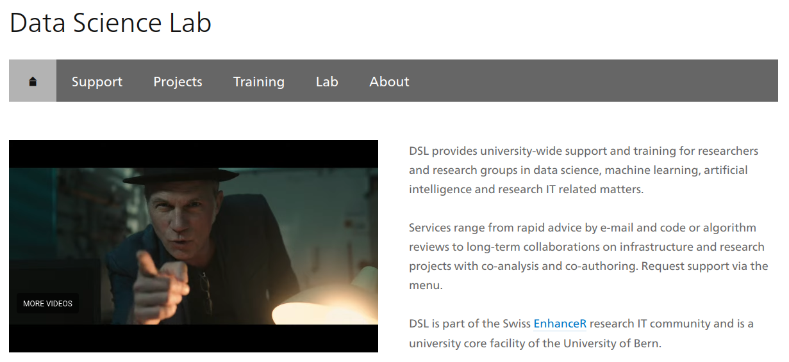

https://dsl.unibe.ch | https://github.com/dsl-unibe-ch

---

## Struktur und Rollen

* Team von 5-7 KollegInnen
* Zuständig für den Bereich *Digital Humanities* (aka *DRUIDS*, "Digital Research, User Interfaces and Data Science for the Humanities")
* Zurzeit betreuen wir gut 30 Projekte (laufend oder in Planung)
* Übergreifende Koordination durch einen Domänenleiter

---
## DH-Projekte am DSL, 2026

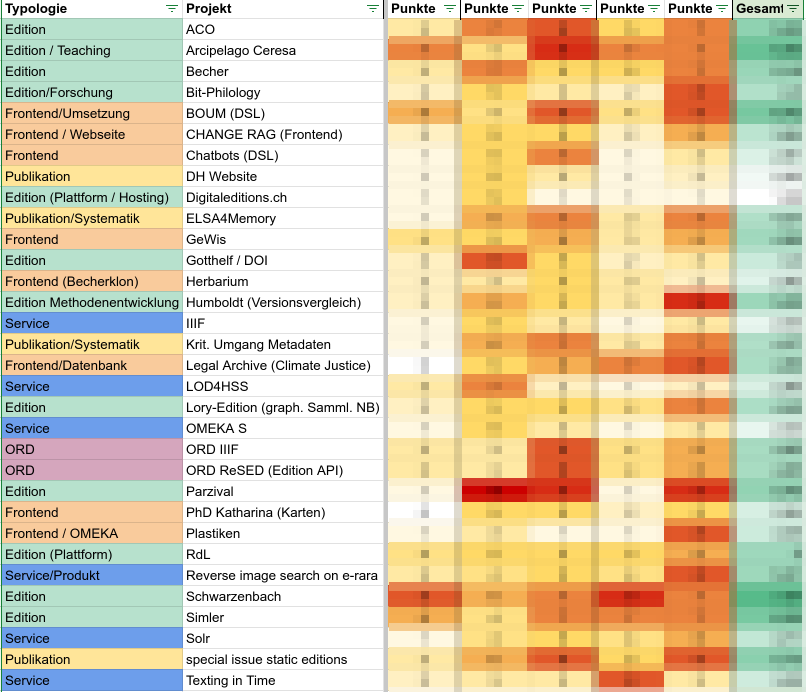

---

## Aktuelle Beispiele

|||
|:--:|:--:|
||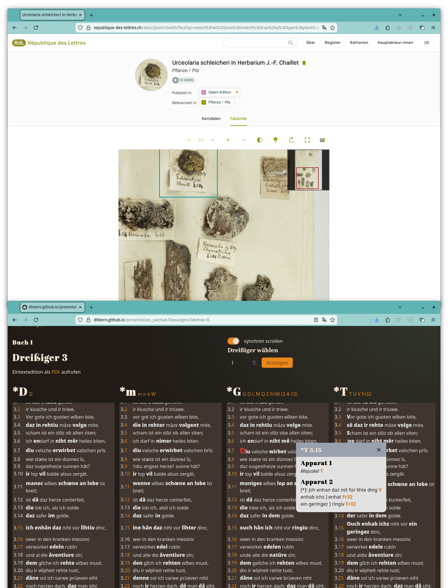|


---

## Ressourcen am Leben zu erhalten ist schwierig

|||
|:--:|:--:|
|[](https://parzival.unibe.ch/parzdb/index.php) | |

<style>
  .slide img {
    max-height: 500px;        
    }
</style>
---

## Code-sharing-Plattformen nutzen (CSP)
<div style="display: flex;">
<div>

- Planung
- Development
- Deployment

</div>


</div>


---

## Anwendungsgebiete

- Project management
- Data generation
- Data management
- Data provision
- Data publication

---
  
<div class="footer" data-marked="1">

||||||
|:--:|:--:|:--:|:--:|:--:|
| project management | data generation | data management | data provision | data publication |

</div>

### Project management: Issues erstellen

|||
|:--:|:--:|
|Problem|Projekte haben eine lange Dauer und mehrere Mitarbeiter.|
|Ansatz|Wir erstellen Issues, denen wir Fälligkeiten und verantwortliche Personen zuweisen.|
|CSP (GitHub)|GitHub **issues**|

---

[](https://github.com/DHBern/presentation_parzival/issues/108)
---
  
<div class="footer" data-marked="1">

||||||
|:--:|:--:|:--:|:--:|:--:|
| project management | data generation | data management | data provision | data publication |

</div>

### Project management: Kanban Boards

|||
|:--:|:--:|
|Problem|Mangelnde Übersicht über viele Issues und  daran arbeitende Personen.|
|Ansatz|Wir erstellen Kanban Boards|
|CSP (GitHub)|GitHub **kanban boards**|
|Grenzen|Zu umfassendem Projektmanagement fehlen einige Features (Zeiterfassung, projektübergreifende Übersicht etc.)|

---


---
  
<div class="footer" data-marked="2">

||||||
|:--:|:--:|:--:|:--:|:--:|
| project management | data generation | data management | data provision | data publication |

</div>

### Data generation: gezielte IIIF Manifeste

|||
|:--:|:--:|
|Problem|Projekte kombinieren häufig Bildressourcen von verschiedenen Anbietern|
|Ansatz|Wir erstellen „Meta“-Manifeste, die auf diese Ressourcen verweisen. Diese Manifeste werden a) zur weiteren Verarbeitung und b) zur Präsentation verwendet.|
|CSP (GitHub)|Manifest Generierung aus YAML-Dateien per **commit**.|

---
  
<div class="footer" data-marked="2">

||||||
|:--:|:--:|:--:|:--:|:--:|
| project management | data generation | data management | data provision | data publication |

</div>

|||
|:--:|:--:|
|[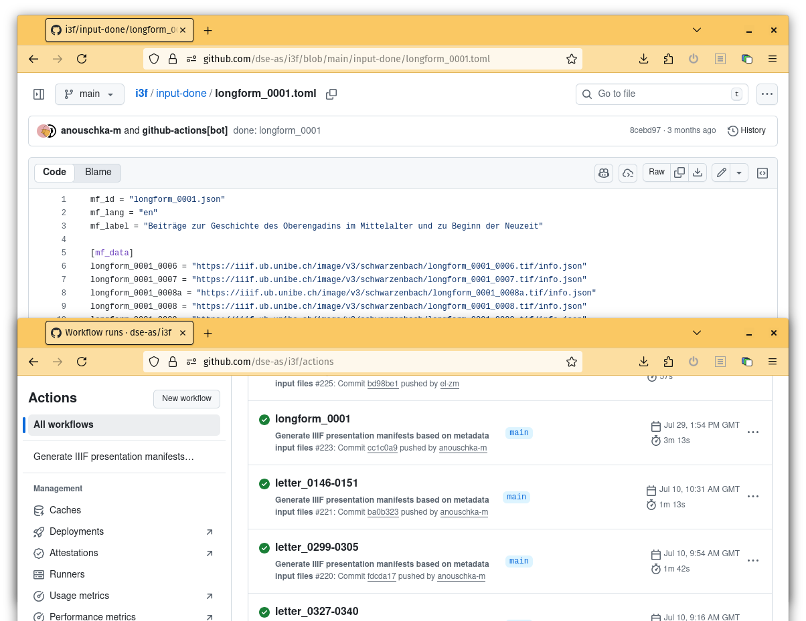]() | 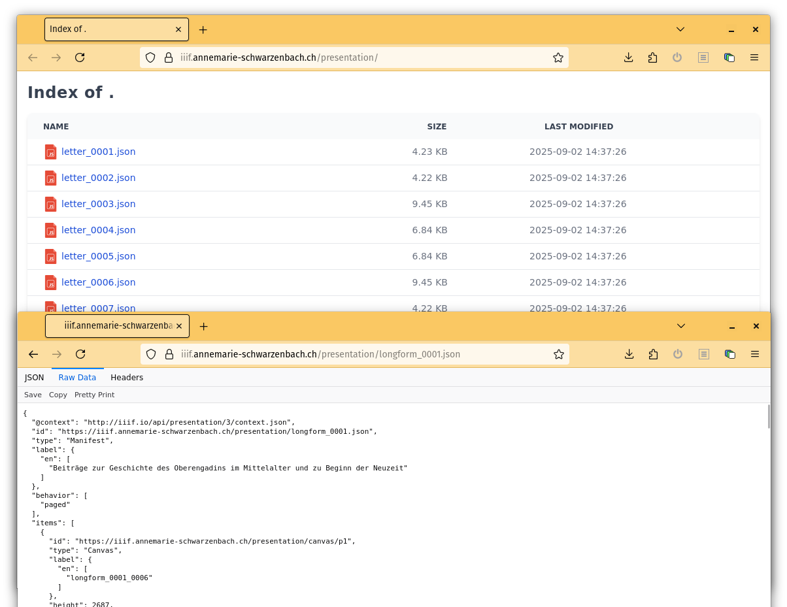|

---
  
<div class="footer" data-marked="2">

||||||
|:--:|:--:|:--:|:--:|:--:|
| project management | data generation | data management | data provision | data publication |

</div>

### Data generation: import zu Transkriptionsplattformen

|||
|:--:|:--:|
|Problem|Das Hochladen von Bildern (z. B. zu Transkribus) ist oft mühsam — Beschaffung der Bilder, Upload, Nachverfolgung von Dateinamen/IDs, Zugriffsfreigaben usw.|
|Ansatz|Wir nutzen die zuvor erzeugten IIIF‑Manifeste, um den gesamten Workflow zu automatisieren.|
|CSP (GitHub)|Durch das Öffnen eines **issue** und die Angabe der Manifeste sowie einer Ziel‑Collection holt eine GitHub‑Action die IIIF‑Bilder und lädt sie zu Transkribus hoch.|

---
  
<div class="footer" data-marked="2">

||||||
|:--:|:--:|:--:|:--:|:--:|
| project management | data generation | data management | data provision | data publication |

</div>

|||
|:--:|:--:|
|[]() | 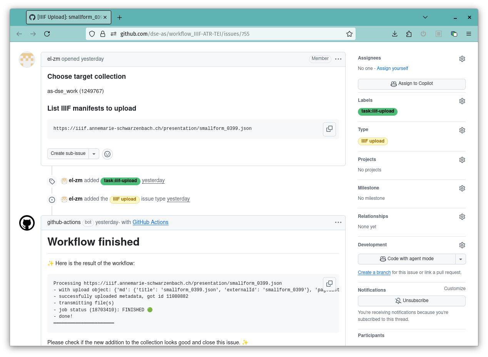|

---
  
<div class="footer" data-marked="2">

||||||
|:--:|:--:|:--:|:--:|:--:|
| project management | data generation | data management | data provision | data publication |

</div>

### Data generation: Export aus Transkriptionsplattformen und Daten-Transformationen

|||
|:--:|:--:|
|Problem|Das Exportieren von Transkriptionen aus Transkribus kann knifflig sein, da die Plattform unterschiedliche Dateinamen verwendet und die eingebauten Transformationen nicht den Projektanforderungen entsprechen.|
|Ansatz|Nutzung von Projekt‑IDs und den zuvor erzeugten IIIF‑Manifests, um Transkriptionen gemäss den Projektvorgaben zu exportieren und zu transformieren.|
|CSP (GitHub)|Durch das Öffnen eines **issue** und die Angabe einer Dokument‑ID holt eine GitHub‑Action die Transkriptionen, ordnet die korrekten Bilddateinamen zu und wendet projektspezifische strukturelle Transformationen an.|

---
  
<div class="footer" data-marked="2">

||||||
|:--:|:--:|:--:|:--:|:--:|
| project management | data generation | data management | data provision | data publication |

</div>

|||
|:--:|:--:|
|[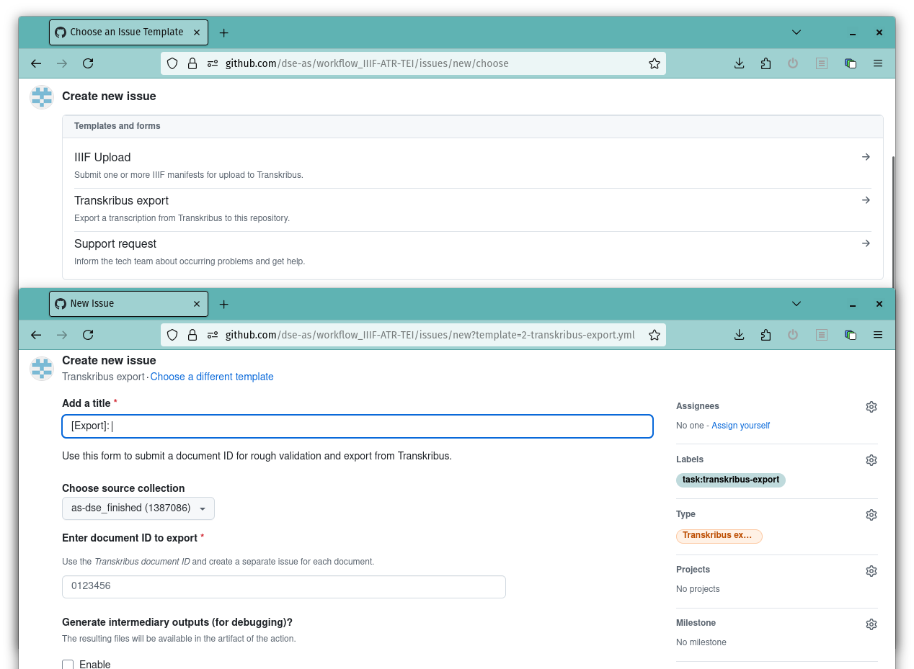]() | 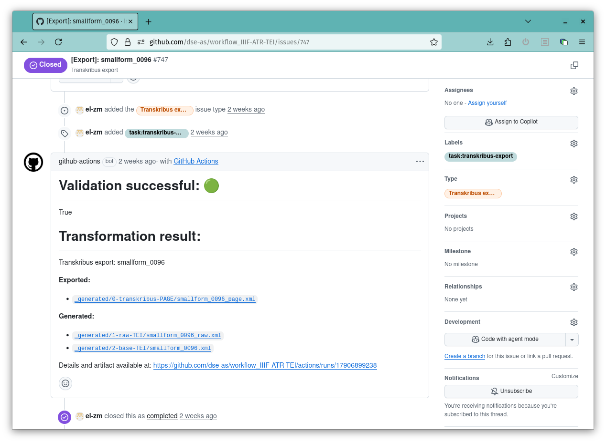|


---
  
<div class="footer" data-marked="3">

||||||
|:--:|:--:|:--:|:--:|:--:|
| project management | data generation | data management | data provision | data publication |

</div>

### Data management: Versionierung von Textdaten

|||
|:--:|:--:|
|Problem|TEI-Dateien werden während der manuellen Bearbeitung und Annotation auf einem Server gespeichert. Änderungen und Projektfortschritt lassen sich nicht ohne erheblichen Mehraufwand für die Editierenden verfolgen.|
|Ansatz|Automatisierte Versionskontrolle (Git) zur Nachverfolgung von Änderungen und als zusätzliche Sicherung.|
|CSP (GitHub)|In festgelegten Intervallen (z. B. alle 6 Stunden) werden alle veränderten Dateien abgeholt und per **scheduled action** im GitHub-Repository gesichert.|
|Grenzen|Commits bilden zeitliche Schnappschüsse ab, nicht Aufgaben oder Workflow‑Schritte.|

---
  
<div class="footer" data-marked="3">

||||||
|:--:|:--:|:--:|:--:|:--:|
| project management | data generation | data management | data provision | data publication |

</div>

|||
|:--:|:--:|
|[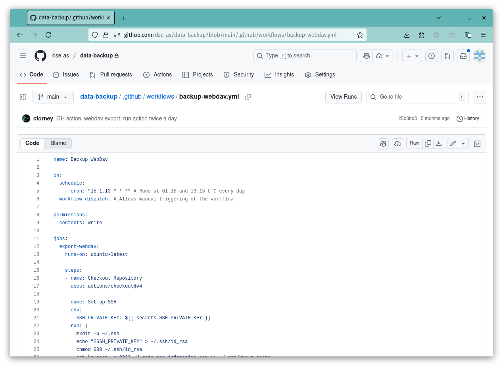]() | 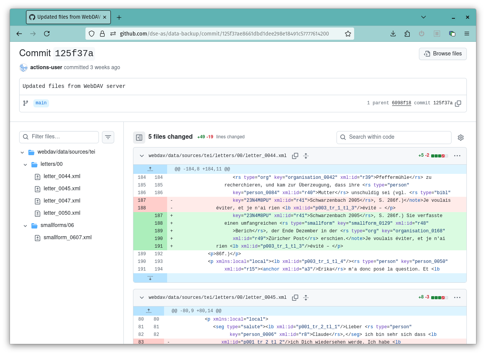|

---
  
<div class="footer" data-marked="4">

||||||
|:--:|:--:|:--:|:--:|:--:|
| project management | data generation | data management | data provision | data publication |

</div>

### Data provision: Generierung statischer Outputs

|||
|:--:|:--:|
|Problem|Zur Publikation werden spezifische Datenrepräsentationen benötigt. Gleichzeitig sind wir nicht in der Lage, maßgefertigte dynamische Systeme langfristig am Laufen zu halten.|
|Ansatz|Vorabgenerierung von Intermediär- und Distributionsformaten für Transkriptionen, Annotationen und andere Projektressourcen.|
|CSP (GitHub)|Bereitstellung der Ergebnisse der Generierungspipelines (XProc, XSLT) als **GitHub Page** („static API“).|

---
  
<div class="footer" data-marked="4">

||||||
|:--:|:--:|:--:|:--:|:--:|
| project management | data generation | data management | data provision | data publication |

</div>

|||
|:--:|:--:|
|[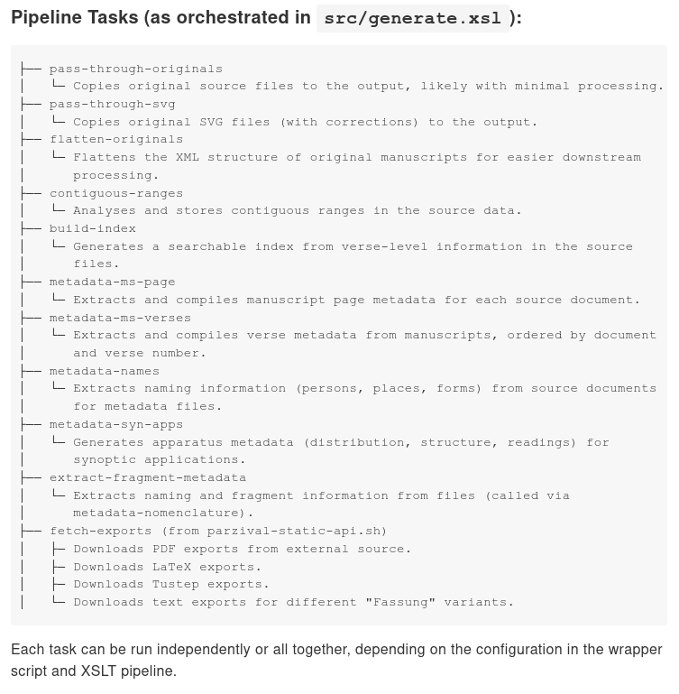]() | 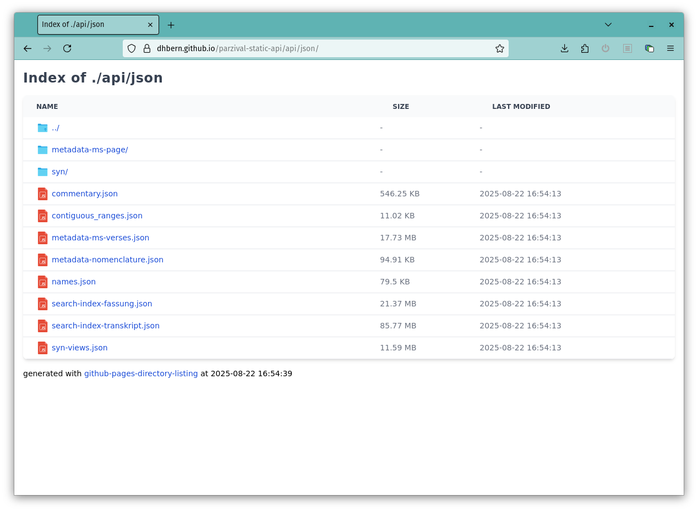|

---
  
<div class="footer" data-marked="5">

||||||
|:--:|:--:|:--:|:--:|:--:|
| project management | data generation | data management | data provision | data publication |

</div>

## Data publication: as static as possible

|||
|:--:|:--:|
|Problem|Der Betrieb von Backend‑Servern und Datenbanken verursacht hohen Wartungsaufwand, Sicherheitsrisiken und laufende Kosten.|
|Ansatz|Statische Websites sind sicher, schnell und wartungsarm.|
|CSP (GitHub)|GitHub **Actions** und **Pages**|
|Grenzen|Für dynamische Funktionalitäten (Suche, IIIF usw.) nutzen wir universitätsweite Dienste.|

---
  
<div class="footer" data-marked="5">

||||||
|:--:|:--:|:--:|:--:|:--:|
| project management | data generation | data management | data provision | data publication |

</div>

### Data publication: Frontendentwicklung

|||
|:--:|:--:|
|Problem|Obskure Nischen‑Programmierpraktiken erschweren Personalsuche und Onboarding.|
|Ansatz|Der Einsatz moderner JavaScript‑Frameworks und Standards ermöglicht schnelle Entwicklung qualitativ hochwertiger Lösungen.|
|CSP (GitHub)|Statische Website‑Generierung mit GitHub **Actions** (geht weit über SSG‑Tools wie Jekyll hinaus).|


---
  
<div class="footer" data-marked="5">

||||||
|:--:|:--:|:--:|:--:|:--:|
| project management | data generation | data management | data provision | data publication |

</div>

### Data publication: Webhosting mit Github Pages

|||
|:--:|:--:|
|Problem|Das Hosten generierter Seiten auf eigenen virtuellen Maschinen ist mit höherem Wartungsaufwand verbunden.|
|Ansatz|Wir nutzen GitHub Pages, um sichere und schnelle statische Websites bereitzustellen.|
|CSP (GitHub)|GitHub **Pages**|

---
  
<div class="footer" data-marked="5">

||||||
|:--:|:--:|:--:|:--:|:--:|
| project management | data generation | data management | data provision | data publication |

</div>

#### Das Frontend _builden_ mit _Actions_

<div style="display: flex; ">

```
build_site:
    runs-on: ubuntu-latest
    services:
      existdb:
        image: existdb/existdb:6.2.0
        ports:
          - 8081:8080
```

```
steps:
- name: Install dependencies
  run: npm ci

- name: start docker
  env:
    EXISTDB_USER: 'admin'
    EXISTDB_SERVER: 'http://127.0.0.1:8081'
  run: npm run installXar

- name: build
  env:
    BASE_PATH: '/${{ github.event.repository.name }}'
    NODE_OPTIONS: '--max_old_space_size=9000'
  run: npm run build
```

</div>
---
## Exkurs: teiPublisher – eine taugliche Fertiglösung?

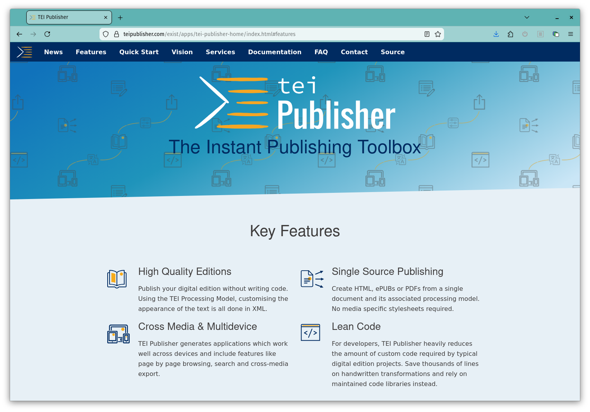

<style>
  .slide img {
    max-height: 500px;        
    }
</style>
---
Pro:
- Verbreitung, Community (D-A-CH)
- verspricht enorm viele Funktionen
- definiertes TEI-Rendering für viele Elemente/Strukturen

Contra:
- entkoppelt vom Dateisystem; keine direkte Versionierung
- laufende Anwendung erforderlich
- viel Abstraktion, oft hohe Komplexität
- Betrieb bedingt Spezialwissen (z.B. für Backup/Restore, Updates)

---

## Überblick über den Workflow anhand von Parzival
Konzept: <del>teiPublisher</del> → Popup-Publisher
---

TEIPublisher nur für rendering der text views / Transkriptionen

```
fetch(
`${teipb}/parts/${element.handle}.xml/json
?odd=parzival.odd
&view=single
&xpath=//text/body/l[@xml:id=%27${element.handle}_${thirties}.${verse}%27]`)
```

kleingranular möglich durch [XQuery-API (rendered snippets)](https://dhbern.github.io/presentation_parzival/einzelverssynopse/103/07)

---

In der ODD werden nur CSS-Klassen zugewiesen.
```
<elementSpec ident="seg" mode="change">
    <model behaviour="inline" cssClass="glory-initial">
        <param name="subtype" value="Prachtinitiale"/>
    </model>
    <model behaviour="inline" cssClass="initial" useSourceRendition="true">
        <param name="type" value="Initiale"/>
    </model>
</elementSpec>
```
Funktionalität und Design nur im Frontend

---

[Starten der TEI-Publisher-App im build](https://github.com/DHBern/presentation_parzival/blob/main/.github/workflows/main.yml)

```
jobs:
  build_site:
    runs-on: ubuntu-latest
    services:
      existdb:
        image: existdb/existdb:6.2.0
        ports:
          - 8081:8080
    steps:
      - name: Install dependencies
        run: npm ci

      - name: start docker
        env:
          EXISTDB_USER: 'admin'
          EXISTDB_PASS: ''
          EXISTDB_SERVER: 'http://127.0.0.1:8081'
        run: |
          npm run installXar
```
---
[Die Webseite als statische Seite mit SvelteKit _herausrechnen_ (prerender)](https://github.com/DHBern/presentation_parzival/blob/main/src/routes/fassungen/data/%5Bthirties%5D/%2Bserver.js)

```javascript
export async function entries() {
	const entriesArray = Array.from({ length: 827 }, (_, i) => ({ thirties: String(i + 1) }));
	return entriesArray;
}

export const prerender = true;
```
---


---
### Resultat
8 GB an HTML, CSS und JS Dateien

[dhbern.github.io/presentation_parzival/](https://dhbern.github.io/presentation_parzival/)
---
Vorteile
- solide Grundlage zum Langzeitbetrieb
- inhaltliche Anpassungen sind möglich
- praktisch keine Wartung nötig
- Wartung ohne Domänenkenntnisse möglich
- hohe Performanz
- hohe Zugänglichkeit
- Nachhaltig, da nicht rechenaufwändig
---
Nachteile

- keine Server-seitige Suche möglich (client-seitig schon)
- lange build-Zeiten (3h)
- keine voll ausgereifte API
---

Danke für die Aufmerksamkeit.
